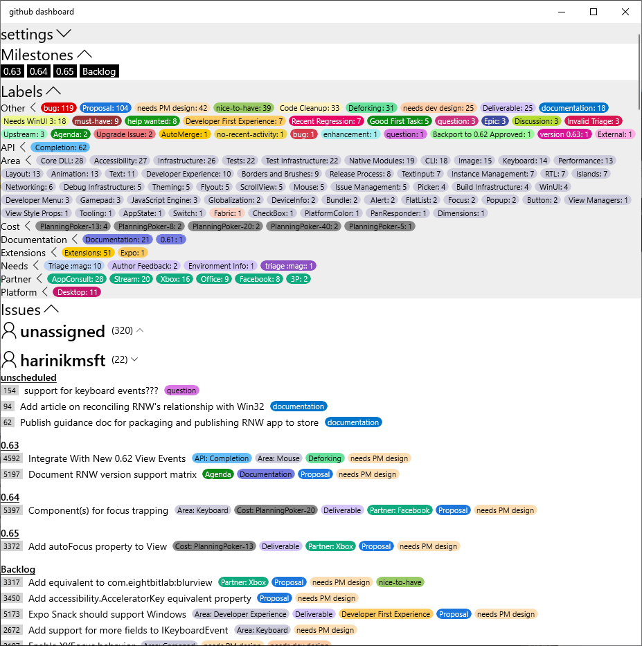

# react-native-github-dashboard

A React Native application for querying GitHub issues:
- Combine issues from multiple repos
- Pulls down all github paginated data
- Cache query results
- Organized view
  - grouped by Assignee
  - grouped by Milestone
- Filter content
  - by Label
  - by Milestone
- Act on content: Issues when clicked will launch the GitHub webpage for that issue.

# Try it out

You can load it from the browser [here](https://chrisglein.github.io/github-dashboard/).

- [View PRs across multiple repos](https://chrisglein.github.io/github-dashboard/?issueType=pull_request)
- [View assigned issues across multiple repos](https://chrisglein.github.io/github-dashboard/?assignee=chrisglein)
- [View issues in a milestone shared across multiple repos](https://chrisglein.github.io/github-dashboard/?milestone=0.67)

## Desktop
The Windows desktop app loads a very similar experience as a native app. Eventually that [will be published to the Microsoft Store](https://github.com/chrisglein/react-native-github-dashboard/issues/51), but in the meantime you can only run it by cloning the repo.


# How to run

### Windows
```
yarn windows
```

### Web
```
yarn web-server
```
Then connect your web browser for `localhost:8080`
